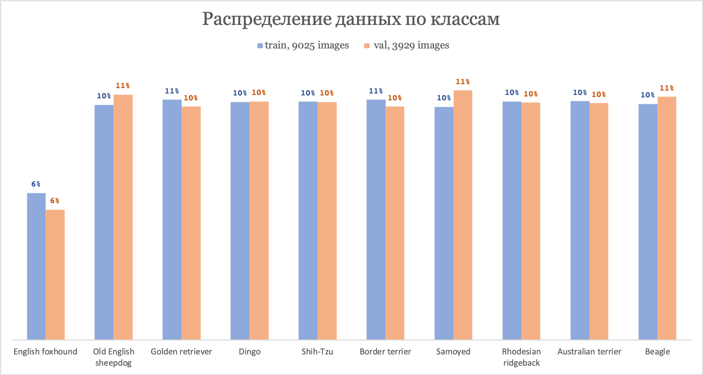

# Telegram bot for dog breed classification
Бот для классификации пород собак по фотографии собаки

Ссылка на бот: https://t.me/DogClfBot

# Demo


# Dataset

ImageWoof - 10 классов собак

Ссылка: https://github.com/fastai/imagenette

# EDA


# Model

EfficientNet-B0

Ссылка на статью: https://arxiv.org/abs/1905.11946

# Classification Report

```text
Testing: loss = 0.5744, accuracy = 0.8127.

                      precision    recall  f1-score   support

            Shih-Tzu       0.78      0.83      0.81       409
 Rhodesian ridgeback       0.87      0.82      0.84       408
              Beagle       0.70      0.86      0.77       418
    English foxhound       0.89      0.42      0.57       224
      Border terrier       0.89      0.80      0.84       401
  Australian terrier       0.89      0.81      0.84       407
    Golden retriever       0.81      0.80      0.80       401
Old English sheepdog       0.88      0.81      0.84       422
             Samoyed       0.83      0.92      0.88       429
               Dingo       0.72      0.87      0.79       410

            accuracy                           0.81      3929
           macro avg       0.83      0.79      0.80      3929
        weighted avg       0.82      0.81      0.81      3929
```
